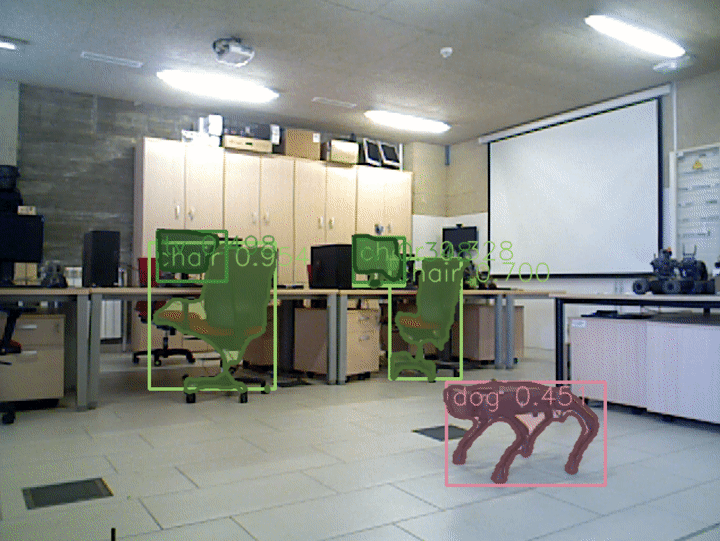
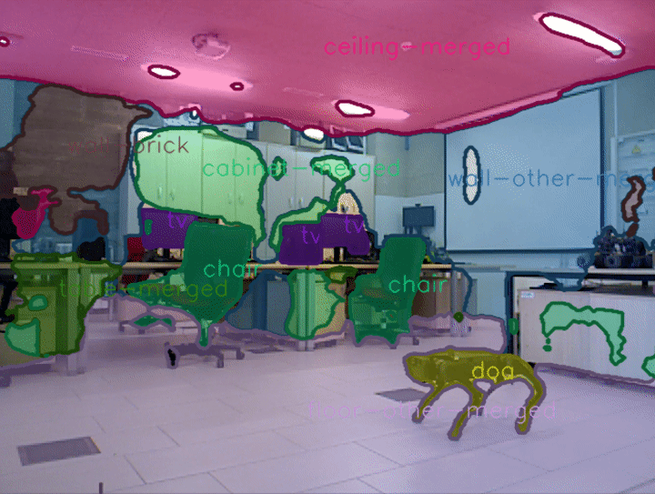

# mmdetection_ros

ROS 2 wrap for [MMDetection](https://github.com/open-mmlab/mmdetection). Object detection, instance segmentation and panoptic sementation are supported.

## Table of Contents

1. [Installation](#installation)
2. [Nodes](#nodes)
3. [Usage](#usage)
4. [Demo](#demo)

## Installation

```shell
# Ubuntu 20.04 CUDA 10.1
$ pip3 install torch==1.8.1+cu101 torchvision==0.9.1+cu101 torchaudio==0.8.1 -f https://download.pytorch.org/whl/torch_stable.html
$ pip3 install mmcv-full -f https://download.openmmlab.com/mmcv/dist/cu101/torch1.8.0/index.html
$ pip3 install mmcv mmdet
$ cd ~/ros2_ws/src
$ git clone https://github.com/mgonzs13/mmdetection_ros.git
$ cd ~/ros2_ws
$ rosdep install --from-paths src -r -y --ignore-src
$ colcon build
```

## Nodes

### MmDetectionNode

This node run MMDetection.

#### Subscribers

- `image_raw` (type `sensor_msgs/msg/Image`) - Input images to feed to the detector

#### Publishers

- `detections` (type `mmdetection_msgs/msg/Detections`) - Detections found in the image (boxes and masks)

#### Services

- `enable` (type `std_srvs::srv::SetBool`) - Enable/disable the detector

#### Parameters

- `config` - a path to a file describing a network
- `weights` - a path to a file with weights/checkpoints for the given network
- `device` - device to use (GPU/CPU)
- `threshold` - minimum probability of a detection to be published
- `detection.nms_threshold` - Non-maximal Suppression threshold - controls filtering of overlapping boxes

### VisualizationNode

This node publish the resulting image after applying the detections.

#### Subscribers

- `image_raw` (type `sensor_msgs/msg/Image`) - Input images to feed to the detector
- `detections` (type `mmdetection_msgs/msg/Detections`) - Detections found in the image (boxes and masks)

#### Publishers

- `result_image` (type `sensor_msgs/msg/Image`) - Output image after applying detections

#### Parameters

- `alpha` - alpha factor to apply in masks
- `thickness` - thickness for line drawing

## Usage

```shell
$ ros2 launch mmdetection_bringup mmdetection.launch.py
```

### Launch configuration

- `network_config` - Network configuration file (.py)
- `weights` - Weights (checkpoints) file (.pth)
- `device` - Device to use (GPU/CPU)
- `enable` - Wheter to start darknet enabled
- `threshold` - Minimum probability of a detection to be published
- `publish_result_image` - Whether to publish result images with detections
- `show_debug_image` - Whether show image with the detections
- `input_image_topic` - Name of the input image topic
- `namespace` - Namespace for the nodes

## Demo

```shell
$ ros2 run usb_cam usb_cam_node_exe
```

```shell
$ wget https://download.openmmlab.com/mmdetection/v2.0/yolox/yolox_tiny_8x8_300e_coco/yolox_tiny_8x8_300e_coco_20211124_171234-b4047906.pth
$ ros2 launch mmdetection_bringup mmdetection.launch.py network_config:=~/ros2_ws/src/mmdetection_ros/mmdetection_bringup/config/yolox/yolox_tiny_8x8_300e_coco.py weights:=yolox_tiny_8x8_300e_coco_20211124_171234-b4047906.pth
```

### Examples

- yolox_tiny_8x8_300e_coco_20211124_171234-b4047906.pth
  

- yolact_r50_1x8_coco_20200908-f38d58df.pth
  

- panoptic_fpn_r50_fpn_1x_coco_20210821_101153-9668fd13.pth
  
